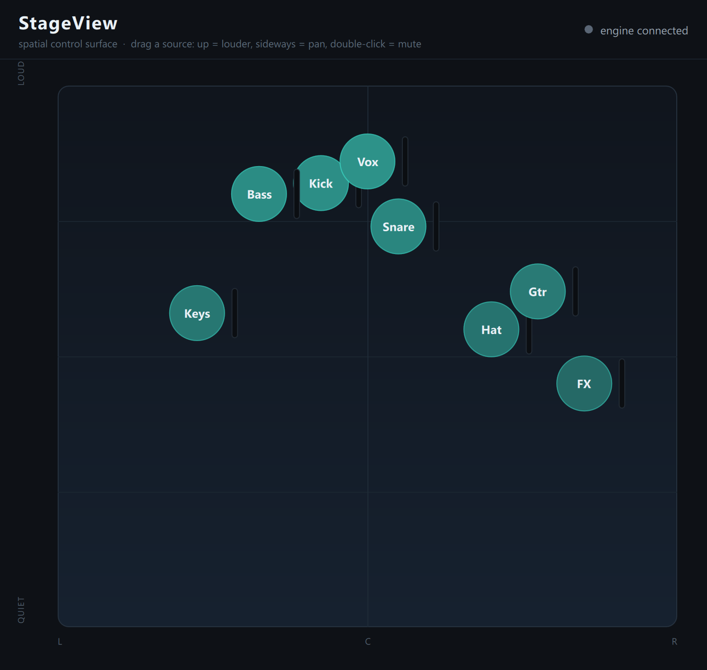

# StageView

[](https://github.com/MattBrookPro/StageView/actions/workflows/ci.yml)

**A spatial control surface over a networked audio engine.**



StageView is a control surface that does not look like a mixer. Instead of channel
strips, it shows inputs as **positions on a top-down stage**: you set level and routing
by dragging sources around a virtual stage, and live meters flow back from the engine in
real time. The surface (Qt/QML and C++) and the audio engine (a separate process) talk
over **OSC on UDP**, the same way a hardware control surface is separated from the engine
that does the audio.

The interesting question this project explores is not how to clone a mixer, but how a
control surface should feel for the person whose hands are on it during a show.

## Architecture

```
+-----------------------------+        OSC over UDP        +----------------------------+
|  StageView surface (C++)     |  <---------------------->  |  Audio engine (separate    |
|  - QML stage canvas (UI)     |   /channel/N/level  -->    |  process)                  |
|  - C++ backend (model)       |                            |  - holds channel state     |
|  - network thread (UDP)      |   <-- meter feed (50 Hz)   |  - real-time stem playback |
|  - UI thread (60 fps)        |                            |  - speaks OSC over UDP      |
+-----------------------------+                            +----------------------------+
```

Two processes, talking over the network: the same shape as a surface and its engine. The
core challenge is the **thread boundary**. A network thread receiving meter data at ~50 Hz
must hand it to the UI thread without ever blocking the 60 fps render. Getting that handoff
right is most of the real work, and it is documented in detail in
[`ARCHITECTURE.md`](ARCHITECTURE.md).

| Layer | Tech | Role |
|---|---|---|
| Surface UI | **Qt 6 / QML (Quick)** | The stage canvas, draggable sources, live meters |
| Surface backend | **C++17** | Stage model, OSC codec, UDP networking, thread handoff |
| Transport | **OSC over UDP** | Control out, meters in |
| MIDI input | **RtMidi** (WinMM/ALSA/CoreMIDI) | Optional hardware control: CC7 = level, CC10 = pan, per source |
| Audio engine | **C++ / RtAudio** | Real-time stem playback with per-channel **zero-latency EQ and compressor**; real meters |
| Mock engine | **Python** | No-audio stand-in: state and synthetic meters, for the surface, tests and CI |
| Build | **CMake + Ninja** | One cross-platform build description |
| CI | **GitHub Actions** | Builds the surface and exercises the engine on every push |

## Build

### Prerequisites
- **Qt 6.5+** with the *Quick*, *Network* and *QuickControls2* modules
- A C++17 compiler (MinGW or MSVC on Windows, GCC/Clang elsewhere)
- **CMake 3.21+** and **Ninja**
- **Python 3.10+** for the mock engine

### The surface (C++/Qt)

```pwsh
# Windows convenience wrapper (pins the local Qt mingw_64 toolchain):
pwsh tools/dev-build.ps1 -Run
```

To launch the built exe by **double-clicking it from Explorer** (or to hand the folder
to someone else), deploy the Qt and MinGW runtime next to it first. Otherwise Windows
reports a missing `Qt6*.dll`, because those are only on the PATH when launched via the
wrapper:

```pwsh
pwsh tools/deploy.ps1        # copies Qt DLLs, QML plugins and MinGW runtime into build/bin
```

Or directly with CMake on any platform:

```bash
cmake -S . -B build -G Ninja -DCMAKE_PREFIX_PATH=/path/to/Qt/6.x/<kit>
cmake --build build
./build/app/stageview        # stageview.exe on Windows
```

### The mock engine (Python), no audio, for quick testing

```bash
python engine/mock_engine.py        # listens for control, broadcasts synthetic meters
```

### The real audio engine (C++), plays stems with live DSP

```pwsh
pwsh tools/prepare-stems.ps1         # convert your stems (MP3) to a local WAV cache + stems.json
./build/bin/stageaudio               # play and mix the stems, OSC on :9000
```

Then launch the surface and it connects automatically. Click a source to open its
**EQ and compressor** panel; drag a source to set level and pan. The DSP adds no latency
(minimum-phase biquad EQ, no-lookahead compressor) and runs on a real-time RtAudio
callback. Stems are read from a local cache and are **never committed** (bring your own
audio).

## Tests

```bash
ctest --test-dir build --output-on-failure        # C++: OSC codec, MIDI mapper, threaded endpoint
python -m unittest discover -s engine -p "test_*.py"   # Python: OSC codec
```

The C++ and Python OSC suites pin the *same* canonical bytes, so the two codecs are
wire-compatible by construction. `endpoint_test` drives a real worker thread against a
stand-in engine socket to prove the cross-thread meter handoff. `midi_test` covers the
cross-platform MIDI-to-action mapping without needing a device. CI runs all of this on
Ubuntu, Windows and macOS on every push.

## Status

The MVP spine is complete and verified end-to-end.

- [x] Toolchain and buildable Qt Quick app skeleton
- [x] OSC codec (C++ and Python sides), byte-pinned for interop
- [x] Mock engine: channel state and 50 Hz meter broadcast
- [x] UDP networking on a dedicated thread
- [x] Thread-safe meter handoff to the UI thread
- [x] Spatial stage canvas with draggable sources (drag = level/pan)
- [x] Live meters on the canvas
- [x] Threaded-endpoint integration test and 3-OS CI
- [x] MIDI control input (CC7 = level, CC10 = pan) via RtMidi, same path as the drag
- [x] Real-time C++ audio engine: stem playback with per-channel EQ and compressor
- [x] Per-output monitor mixes with a per-pair stereo/split routing model
- [ ] Second spatial concept (for example proximity grouping or spotlight solo)

## Companion clients (polyglot ecosystem)

StageView's control protocol (OSC/UDP) is language-neutral, so the engine also has
companion clients in several more languages, each implementing the same wire format. See
[`clients/`](clients) and [`clients/README.md`](clients/README.md).

| Client | Language | Role | Status |
|---|---|---|---|
| [`clients/legacy-panel-pascal`](clients/legacy-panel-pascal) | Object Pascal (Lazarus/LCL) | Legacy control-panel GUI (scenes, faders, mute, meters) | builds and runs |
| [`clients/console-pascal`](clients/console-pascal) | Object Pascal (Free Pascal) | Console control with **scene recall** | runs |
| [`clients/dashboard-csharp`](clients/dashboard-csharp) | C# / WinForms | Diagnostics and control dashboard | builds and runs |
| [`clients/testrig-csharp`](clients/testrig-csharp) | C# / .NET | Diagnostics **test rig** (PASS/FAIL, CI exit code) | runs |
| [`clients/companion-flutter`](clients/companion-flutter) | Dart / Flutter | **Tablet companion**, personal monitor mix, builds to an Android APK | builds and runs |
| [`clients/companion-dart`](clients/companion-dart) | Dart | The companion as a headless CLI core | runs |

The real-time path stays C++/Qt; these are the legacy-control, tooling and touch-companion
layers around it.

## License

[MIT](LICENSE).
